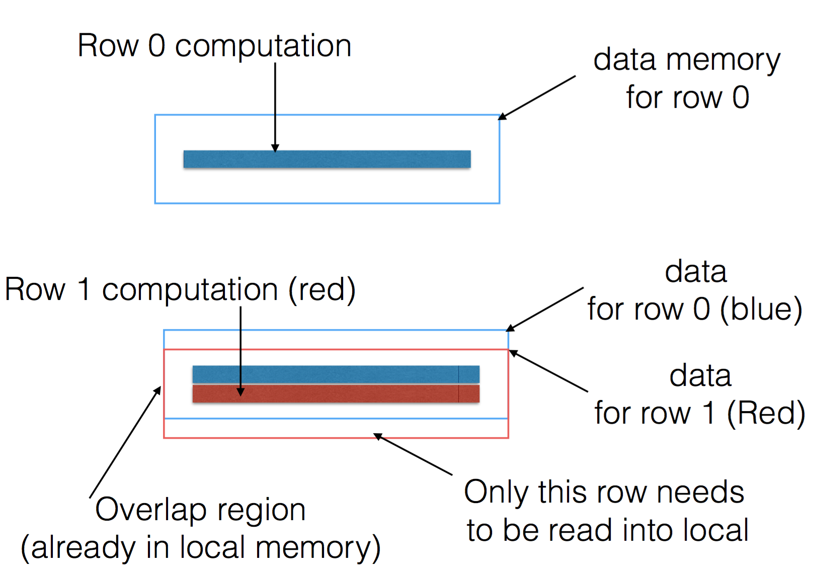
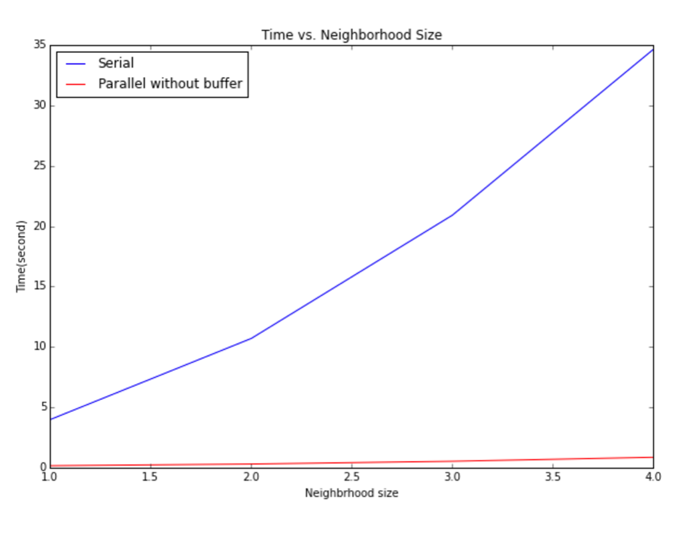
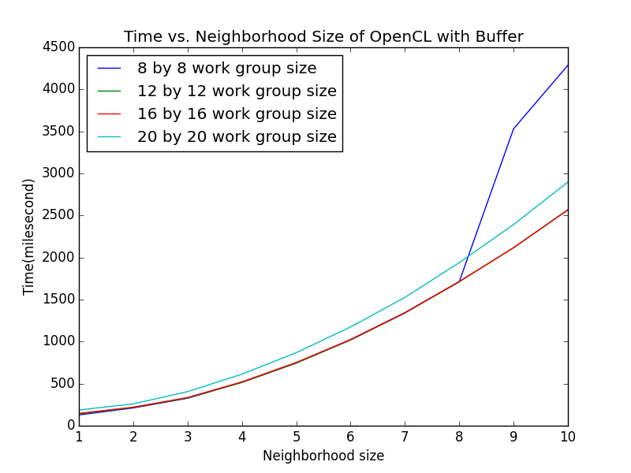

#### Harvard CS205 Parallel Programming Final Project - Bilateral Filtering using OpenCL
============================================
### Authors
* Xide Xia \<xidexia@g.harvard.edu\>
* Ruitao (Toby) Du \<ruitaodu@g.harvard.edu\>

### Project Website
http://xidexia.github.io/Bilateral-Filtering

### Video
https://youtu.be/TRVlFCA-YxQ


### Background and Motivation
Bilateral Filtering is one of the most fundamental operations of image processing. It smooths images while preserving edges, by means of a nonlinear combination of nearby image values. It is a non-iterative, local, and simple method that combines gray levels or colors based on both their geometric closeness and their photometric similarity, and prefers near values to distant values in both domain and range. The basic method behind bilateral filtering is to do update the values of pixels based on their neighborhood. It takes a weighted sum of the pixels in a neighborhood. The values of weights depend on the spatial distance between current pixel to the neighbor as well as on the intensity of the pixels. Because of the way the weights are calculated, the bilateral filtering is able to preserve edges while still averaging and getting rid of the noise.

In this project, our goal is to develop an efficient algorithm for bilateral filtering. In traditional image processings, image filtering are applied to exert various effects on photos. The center of a selected filter matrix has to be multiplied with the current pixel, the other elements of the filter matrix with corresponding neighbor pixels. In other words, only one pixel’s value is going to be changed at one time. In our project, we plan to improve efficiency via parallel computing.


### Description
This project explores different parallel implementations of bilateral filtering in OpenCL and compares the performance of them with the serial version in python. Below is four methods we implemented. In these methods, we all precompute the spatial difference first so that we don't need to calculate them multiple times. 

**1. Serial version with NumPy:** <br>
	Calculate the output pixel by pixel. For each pixel, we need to calculate the pixel difference within a certain neighborhood. To speed up the process, we vectorize the calculation by utilizing NumPy.
    
    
**2. OpenCL version without buffer:** <br>
	Calculate the output pixels in blockwise parallel. We use OpenCL with different work group size to parallelize the code. Work group sizes are 8×8, 12×12, 16×16, 20×20. Inside the OpenCl code, it directly read from global memory when we access the neighborhood. 
    
    
**3. OpenCL version with buffer:** <br>
	Calculate the output pixels in blockwise parallel. We use OpenCL with different work group size to parallelize the code. Work group sizes are 8×8, 12×12, 16×16, 20×20. Inside the OpenCL code, first we read in all neighborhood of a work group to the buffer. And then we access the neighborhood by reading from local memory. This way can save time on accessing the global memory. 
    
    
**4. OpenCL version with buffer and index trick:** <br>
	Calculate the output pixels in columnwise parallel. In previous OpenCL methods, we put some pixels to the buffer multiple times. Work group sizes are 16×8, 20×8, 24×8, 28×8, 20×4, 24×4. Instead, we were reusing the buffer by introducing an index trick. Also, to increase the percentage of reused buffer, we set the work group size to be a long thin rectangle: <br>
	 <br>
	In this way, most of the values in buffer can be reused. 


### Code Instructions

##### Run serial version of bilateral filtering with NumPy.
```
python bilateral_serial.py
```


For OpenCL version, please make sure ``bilateral.cl`` is in the same folder because all kernal functions are in this file.
##### Run openCL version without buffer
```
python bilateral_without_buffer.py
```

##### Run openCL version with buffer
```
python bilateral_buffer.py
```

##### Run openCL version with index trick
```
python bilateral_index.py
```


### Machine Used
**Apple OpenCL version:** OpenCL 1.2 <br>
**CPU:** 
Intel(R) Core(TM) i7-4770HQ CPU @ 2.20GHz <br>
Maximum clock Frequency: 2200 MHz <br>
Maximum allocable memory size: 4294 MB <br>
Maximum work group size 1024 <br>
**GPU:** 
Iris Pro 
Maximum clock Frequency: 1200 MHz <br>
Maximum allocable memory size: 402 MB <br>
Maximum work group size 512 <br>


### Result

#### Parameters
Spatial σ = halo / 2 <br>
Intensity σ = 50 <br>

#### Sample Image
Bilateral filtering of Cat image with different size of neighborhood 
 <br>

Bilateral filtering of Harvard Library image with different size of neighborhood
 <br>


#### Performance

##### Serial vs OpenCL
 <br>

##### Workgroup
**Without buffer: Best work group is 16×16** <br>
 <br>


**With buffer: Best work group is 16×16** <br>
 <br>


**Buffer with index trick: Best work group is 20×8** <br>
 <br>


##### Best method
**Best method: method 3. The one with buffer only.** <br>
 <br>


### Acknowledge
We thank Ray and all CS205 TFs for providing the wonderful course and all helpful instructions.

### Reference
1. Paris, Sylvain, et al. "A gentle introduction to bilateral filtering and its applications." ACM SIGGRAPH 2007 courses. ACM, 2007.

2. Paris, Sylvain, et al. Bilateral filtering: Theory and applications. Now Publishers Inc, 2009.

3. OpenCL, Khronos. "The open standard for parallel programming of heterogeneous systems." Website. URL http://www. khronos. org/opencl. Symposium on Microarchitecture, MICRO.