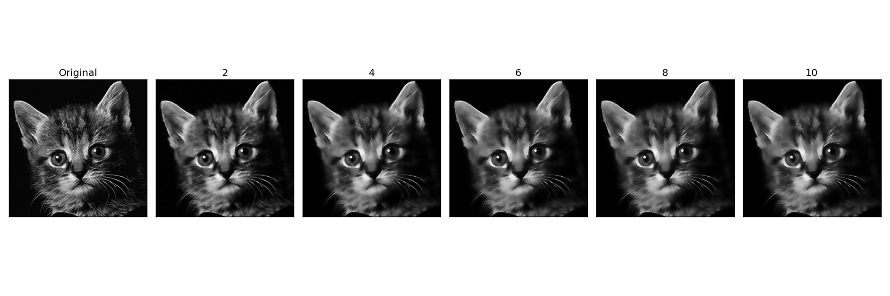
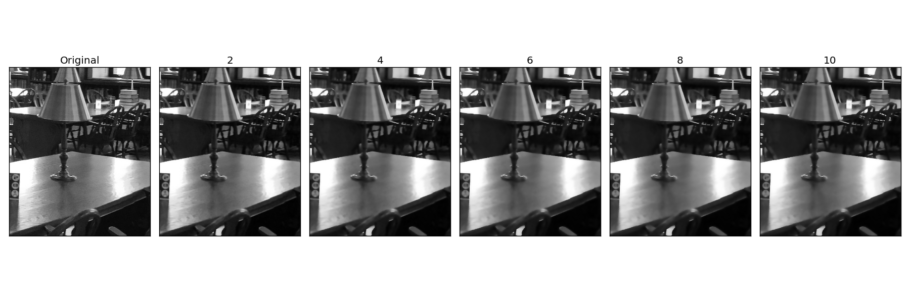

#### Harvard CS205 Parallel Programming Final Project - Bilateral Filtering using OpenCL
============================================
### Authors
* Xide Xia \<xidexia@g.harvard.edu\>
* Ruitao (Toby) Du \<ruitaodu@g.harvard.edu\>

### Background and Motivation


### Description
This project explores different parallel implementations of bilateral filtering in OpenCL and compares the performance of them with the serial version in python. Below is four methods we implemented. In these methods, we all precompute the spatial difference first so that we don't need to calculate them multiple times. 

**1. Serial version with NumPy:**\
	Calculate the output pixel by pixel. For each pixel, we need to calculate the pixel difference within a certain neighborhood. To speed up the process, we vectorize the calculation by utilizing NumPy.
    
    
**2. OpenCL version without buffer:**\
	Calculate the output pixels in blockwise parallel. We use OpenCL with different work group size to parallelize the code. Work group sizes are 4×4, 8×8, 16×16. Inside the OpenCl code, it directly read from global memory when we access the neighborhood. 
    
    
**3. OpenCL version with buffer:**\
	Calculate the output pixels in blockwise parallel. We use OpenCL with different work group size to parallelize the code. Work group sizes are 4×4, 8×8, 16×16. Inside the OpenCL code, first we read in all neighborhood of a work group to the buffer. And then we access the neighborhood by reading from local memory. This way can save time on accessing the global memory. 
    
    
**4. OpenCL version with buffer and index trick:**\
	Calculate the output pixels in columnwise parallel. In previous OpenCL methods, we put some pixels to the buffer multiple times. Work group sizes are 4×4, 8×4, 16×4, 32×4. Instead, we were reusing the buffer by introducing an index trick. Also, to increase the percentage of reused buffer, we set the work group size to be a long thin rectangle:\
	In this way, most of the values in buffer can be reused. 


### Code Instructions

##### Run serial version of bilateral filtering with NumPy.
```
python bilateral_serial.py
```


For OpenCL version, please make sure ``bilateral.cl`` is in the same folder because all kernal functions are in this file.
##### Run openCL version without buffer
```
python bilateral_without_buffer.py
```

##### Run openCL version with buffer
```
python bilateral_buffer.py
```

##### Run openCL version with index trick
```
python bilateral_index.py
```


### Machine Used
**Apple OpenCL version:** OpenCL 1.2 \
**CPU:** 
Intel(R) Core(TM) i7-4770HQ CPU @ 2.20GHz \
Maximum clock Frequency: 2200 MHz \
Maximum allocable memory size: 4294 MB \
Maximum work group size 1024 \
**GPU:** 
Iris Pro \
Maximum clock Frequency: 1200 MHz \
Maximum allocable memory size: 402 MB \
Maximum work group size 512


### Result
#### Sample Image
Bilateral filtering of Cat image with different size of neighborhood \
 \

Bilateral filtering of Harvard Library image with different size of neighborhood \
 \

#### Performance


#### Sample Image -- Harvard Library

All methods yield to same images


#### Performance
