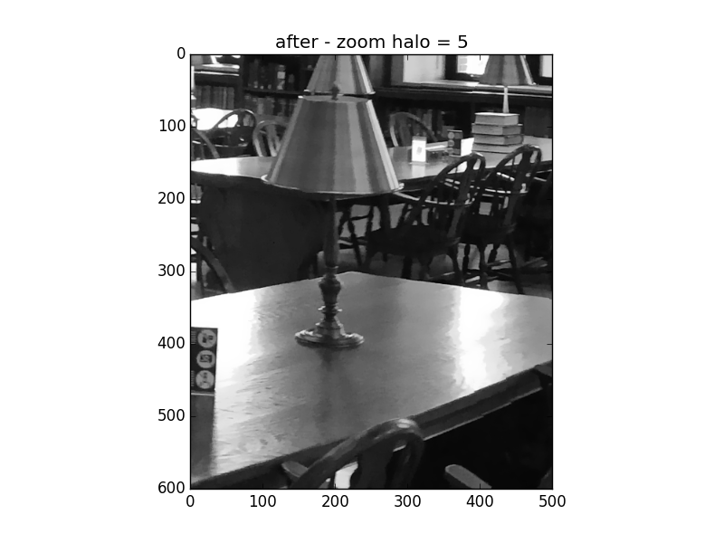
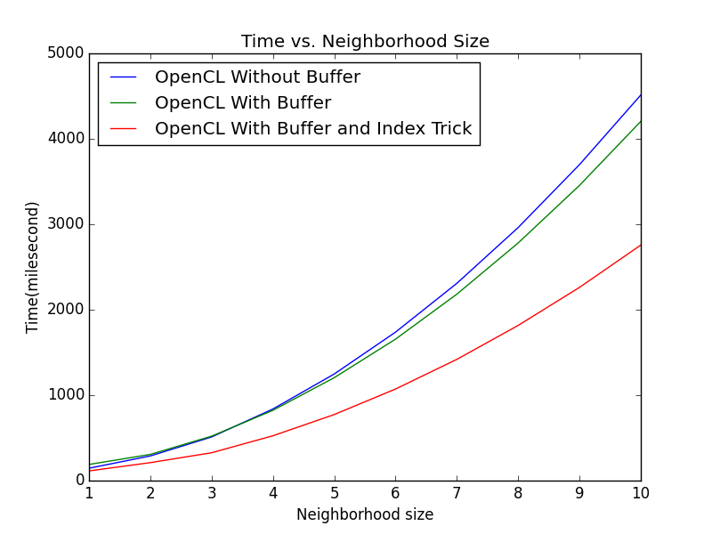
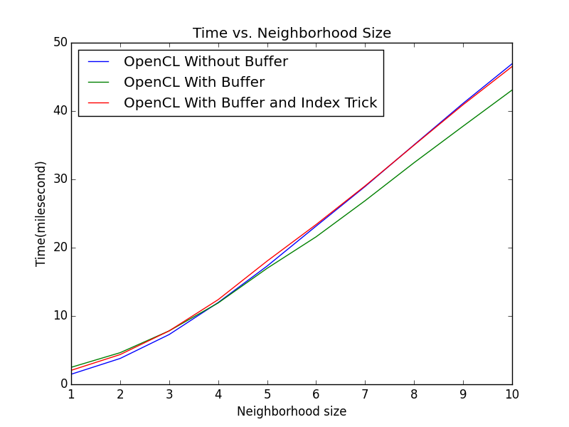

####Harvard CS205 Parallel Programming Final Project - Bilateral Filtering using OpenCL
============================================
### Authors
* Xide Xia \<xidexia@g.harvard.edu\>
* Ruitao (Toby) Du \<ruitaodu@g.harvard.edu\>

### Background and Motivation


I^\text{filtered}(x) = \frac{1}{W_p} \sum_{x_i \in \Omega} I(x_i)f_r(\|I(x_i)-I(x)\|)g_s(\|x_i-x\|),
where the normalization term


W_p = \sum_{x_i \in \Omega}{f_r(\|I(x_i)-I(x)\|)g_s(\|x_i-x\|)}


### Description
This project explores different parallel implementations of bilateral filtering in OpenCL and compares the performance of them with the serial version in python. Here is four methods we implemented:
1. Serial version with NumPy;
2. OpenCL version without buffer;
3. OpenCL version with buffer;
4. OpenCL version with buffer and index trick;


### Code Instructions

##### Serial version of bilateral filtering with NumPy.
```
bilateral_serial.py
```

##### OpenCL version without buffer
```
bilateral.cl
bilateral.py
```


```
bilateral.cl
bilateral_reuse.py
```
python driver to run cl code.


### Result
####Sample Image -- Harvard Library
All methods yield to same images
Halo = 10;


Halo = 5;





#### Performance


#### Sample Image

#### Performance



### References
